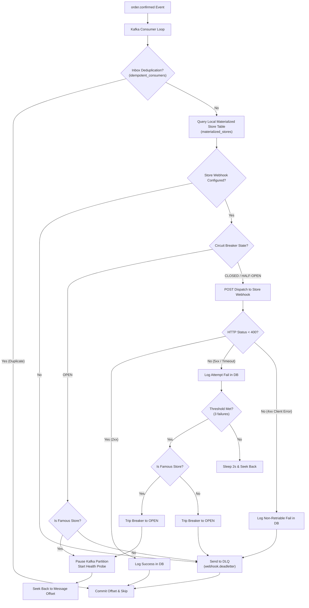
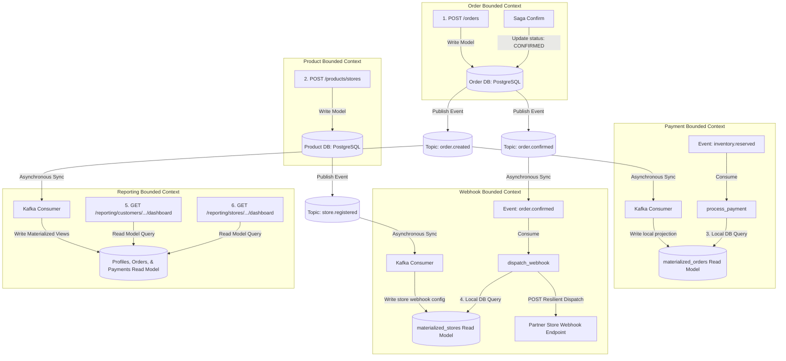
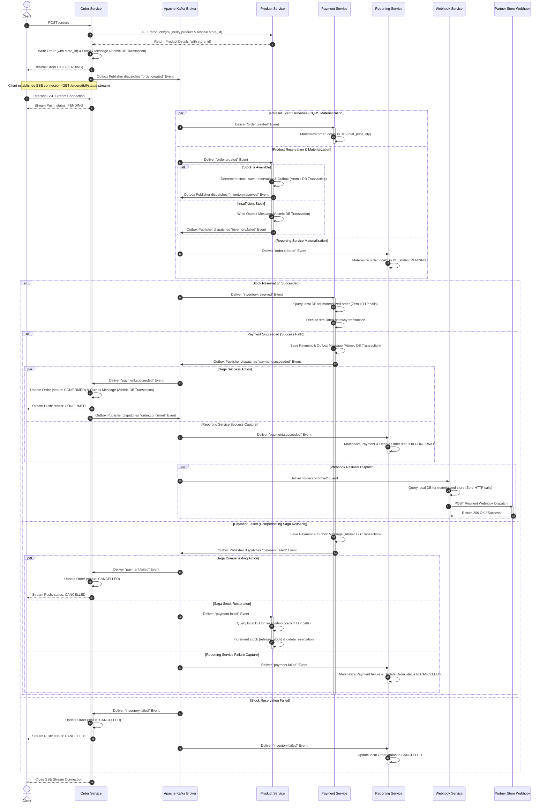
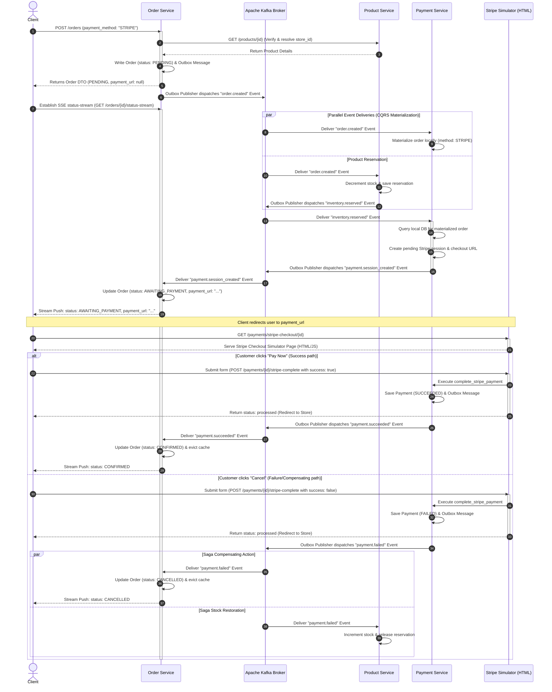

# 🏗️ Event-Driven DDD Microservices Platform with E2E Resilience & Observability

A production-grade, highly available, resilient, and observable E-Commerce platform built using Python **FastAPI**, **Domain-Driven Design (DDD)**, and **Apache Kafka (KRaft mode)**. The system is designed with a decentralized choreographed Saga pattern and robust traffic protection layers, including high-availability gateway routing, rate-limiting, dual-scope circuit breakers, API idempotency, and a complete distributed observability stack.

---

## 🗺️ 1. Architecture Overview

```mermaid
graph TD
    %% Node Definitions
    Client["Client / Locust Load Tester"]
    Keepalived{"Keepalived Master/Backup VRRP"}
    PartnerWebhook["Partner Store Webhook Endpoint"]

    subgraph GatewayRouting ["API Gateway Routing (Traefik)"]
        Traefik["Traefik Master Load Balancer"]
        TraefikBackup["Traefik Backup Load Balancer"]
        Router["Path-Based Prefix Router"]
    end

    subgraph BoundedContexts ["DDD Bounded Contexts (FastAPI)"]
        UserServ["user-service:8001"]
        ProdServ["product-service:8002"]
        OrdServ["order-service:8003"]
        PayServ["payment-service:8004"]
        RepServ["reporting-service:8005"]
        WebhookServ["webhook-service:8006"]
    end

    subgraph DataCaching ["Data & Caching Tier"]
        UserDB[("user_db: PostgreSQL")]
        ProdDB[("product_db: PostgreSQL")]
        OrdDB[("order_db: PostgreSQL")]
        PayDB[("payment_db: PostgreSQL")]
        RepDB[("reporting_db: PostgreSQL")]
        WebhookDB[("webhook_db: PostgreSQL")]
        Redis[("redis: Redis 7")]
    end

    subgraph EventBroker ["Asynchronous Event Broker"]
        Kafka[("Apache Kafka KRaft Broker")]
    end

    subgraph Observability ["Distributed Observability Stack"]
        OTel["OTel Collector:4317"]
        JG["Jaeger UI:16686"]
        PR["Prometheus:9090"]
        LK["Loki:3100"]
        GF["Grafana:3000"]
        AM["Alertmanager:9093"]
    end

    %% Gateway Routing Connections
    Client -->|"Port 80 (Virtual IP)"| Keepalived
    Client -.->|"Direct Checkouts"| Keepalived
    Keepalived -->|"Active Ingress"| Traefik
    Keepalived -.->|"Failover Ingress"| TraefikBackup
    Traefik -->|"Rate Limiting & Load Shedding"| Router
    TraefikBackup -->|"Rate Limiting & Load Shedding"| Router

    %% Bounded Contexts Connections
    Router -->|"/users/*"| UserServ
    Router -->|"/products/*"| ProdServ
    Router -->|"/orders/*"| OrdServ
    Router -->|"/payments/*"| PayServ
    Router -->|"/reporting/*"| RepServ
    Router -->|"/webhooks/*"| WebhookServ

    %% Database Connections
    UserServ -->|"db_breaker"| UserDB
    ProdServ -->|"db_breaker"| ProdDB
    OrdServ -->|"db_breaker"| OrdDB
    PayServ -->|"db_breaker"| PayDB
    RepServ -->|"db_breaker"| RepDB
    WebhookServ -->|"db_breaker"| WebhookDB

    %% Idempotency Cache Connections
    UserServ -->|"Idempotency Cache"| Redis
    ProdServ -->|"Idempotency Cache"| Redis
    OrdServ -->|"Idempotency Cache"| Redis
    PayServ -->|"Idempotency Cache"| Redis
    RepServ -->|"Idempotency Cache"| Redis
    WebhookServ -->|"Idempotency Cache"| Redis

    %% Kafka Event Broker Connections
    UserServ -.->|"kafka_breaker"| Kafka
    ProdServ -.->|"kafka_breaker"| Kafka
    OrdServ -.->|"kafka_breaker"| Kafka
    PayServ -.->|"kafka_breaker"| Kafka
    RepServ -.->|"kafka_breaker"| Kafka
    WebhookServ -.->|"kafka_breaker"| Kafka

    Kafka -.->|"Event Subscription / Inbox Pattern"| UserServ
    Kafka -.->|"Event Subscription / Inbox Pattern"| ProdServ
    Kafka -.->|"Event Subscription / Inbox Pattern"| OrdServ
    Kafka -.->|"Event Subscription / Inbox Pattern"| PayServ
    Kafka -.->|"Event Subscription / Inbox Pattern"| RepServ
    Kafka -.->|"Event Subscription / Inbox Pattern"| WebhookServ

    %% Webhook Outbound Connection
    WebhookServ -->|"POST Resilient Webhook Dispatch"| PartnerWebhook

    %% Observability Connections
    UserServ -->|"OTel Traces & Metrics"| OTel
    ProdServ -->|"OTel Traces & Metrics"| OTel
    OrdServ -->|"OTel Traces & Metrics"| OTel
    PayServ -->|"OTel Traces & Metrics"| OTel
    RepServ -->|"OTel Traces & Metrics"| OTel
    WebhookServ -->|"OTel Traces & Metrics"| OTel
    Traefik -->|"OTel Traces & Metrics"| OTel

    OTel -->|"Traces"| JG
    OTel -->|"Metrics"| PR
    OTel -->|"Logs"| LK
    PR -->|"Dashboards"| GF
    PR -->|"Alerts"| AM
```



---

## 🛡️ 2. Resilience, Protection & Reliability Features

The system implements multi-layered protection to guarantee extreme reliability, operational stability, and self-healing behavior under stress or service degradation:

### A. Ingress Gateway Protection (Traefik)
- **High Availability**: Programmed with active-passive **Keepalived VRRP** clustering (Virtual IP `172.20.0.100`), ensuring instantaneous, zero-downtime failover between `traefik-master` and `traefik-backup`.
- **Rate-Limiting**: Limits average traffic to 30 requests/sec with a burst tolerance of 50 requests. Sudden volume spikes are throttled instantly, returning a `429 Too Many Requests` response to safeguard downstream services.
- **Load-Shedding**: Capped at 50 concurrent in-flight requests. Excess traffic is shed gracefully, preventing resource exhaustion.

### B. Dual-Scope & Database Circuit Breakers
Implemented via a custom async-native `AsyncCircuitBreaker` wrapper (`shared/common/resilience.py`) for complete operational safety:
1. **`db_breaker` (Internal Persistence Protection)**: Applied to every database interaction. If a PostgreSQL instance encounters three consecutive failures (socket timeout, database offline, lock contention), the circuit trips to `OPEN`. Downstream transactions immediately fast-fail with a custom `503 Service Unavailable`, preventing connection-pool deadlock.
2. **`kafka_breaker` (Broker Connectivity Protection)**: Protects event publishing. Prevents background threads from blocking if the Kafka broker experiences transient disconnects or partition rebalances.
3. **Resilient HTTP Client**: Built-in HTTP client wrapper (`shared/common/http_client.py`) automatically wraps external REST calls in a dedicated circuit breaker with exponential backoff retries.
4. **Self-Healing Recovery State Machine**: When the circuit trips, the breaker enters `OPEN` state. After a 15-second cooling period, the next transaction probe transitions the state to `HALF-OPEN`. A successful interaction fully closes the circuit back to `CLOSED`; any failure trips it back to `OPEN`.

### C. End-to-End REST API Idempotency (Redis-Backed)
- Implemented via a high-performance `@idempotent_api` decorator (`shared/common/idempotency.py`).
- Requires mutating requests (`POST`) to contain a unique `X-Idempotency-Key` header.
- Upon receiving a request, the service checks Redis. If the key exists, it returns the cached response instantly, skipping database persistence and business execution. If not, it executes the operation, caches the result in Redis with a TTL, and returns.

### D. Asynchronous Event Consumer Idempotency (Inbox Pattern)
- Event-driven platforms are susceptible to duplicate events due to broker partition rebalancing or network retries.
- Consumers verify and record event IDs in a single atomic transaction. Duplicate events are silently discarded, guaranteeing that stock levels and order statuses are updated exactly once.

### E. Transactional Outbox Pattern (Event-Publishing Resilience)
- **The Issue**: In standard event-driven systems, writing to the database and publishing to Kafka are separate operations. If Kafka goes down or a network timeout occurs right after the database transaction commits, the event is lost. Conversely, if you publish the event first and the DB commit fails, you dispatch a "ghost" event.
- **The Solution**: We implement the **Transactional Outbox Pattern**. When a service updates its database (e.g., creating an order or reserving stock), it writes the event payload into a local `outbox_messages` table within the **same atomic database transaction** (implemented in `shared/common/outbox.py`).
- **Self-Healing & Decoupled Uptime**: A background `OutboxPublisher` task continuously polls the local database table, publishes pending messages to Kafka, and deletes them upon success. If Kafka goes down (tripping the `kafka_breaker`), the API write still succeeds instantly, buffering the messages in PostgreSQL. Once Kafka recovers, the background publisher drains the queue automatically.

### F. Read Fallbacks (Redis Cache-Aside) for Degraded Reads
- **Resilient Fallback**: To preserve system readability during database outages, we implement a Redis-backed cache-aside fallback system. 
- **`@cache_fallback` Decorator**: Applied to `GET` endpoints (e.g. `/products/{id}`, `/users/{id}`). Upon a database lookup failure (or if the database circuit breaker is in `OPEN` state), the decorator intercepts the call, reads the cached DTO from Redis (populated with a 5-minute TTL on prior successful DB reads), and returns it to the client with `200 OK`. 
- **Write Fail-Fast Validation**: While `GET` read endpoints bypass database circuit breaker checks via cache fallbacks, mutating write endpoints (`POST`, `PUT`, `DELETE`) continue to fail-fast immediately if the database breaker is open.

### G. Consumer Retry Loop & Dead Letter Queue (DLQ) Pipeline
- **Transient vs. Non-Transient Failures**: In the background event consumers, exceptions are evaluated by a robust classification function (`is_retriable_exception` in `shared/common/resilience.py`).
  - **Retriable Failures**: Transient issues like network dropouts, database socket timeouts, name resolution errors, or downstream HTTP `5xx` status codes. These are safely retried locally up to 3 times with exponential backoff (e.g. 1s, 2s, 4s).
  - **Non-Retriable Failures**: Programming bugs, schema validation errors (`ValidationError`), database constraint violations (`IntegrityError`), and HTTP `4xx` client errors. These bypass retries entirely to avoid head-of-line partition blocking.
- **Dead Letter Queue (DLQ) Routing**: If all retries for a retriable failure are exhausted, or if a non-retriable failure occurs, the consumer wraps the message in a diagnostic envelope containing metadata (original topic, consumer group, failure timestamp, exception class, error message, and complete traceback stack trace) and routes it to a `.deadletter` topic (e.g. `order.created.deadletter`), then commits the partition offset to keep the stream moving.

### H. DLQ Replay CLI Utility
- **Replay Capabilities**: A dedicated command-line tool `shared/bin/replay_dlq.py` is included to recover from dead-letter failures.
- **Watermark Boundaries**: When executed, it scans DLQ topics, reads partition high watermarks to determine the batch boundaries (preventing infinite tail-chasing loops), reserializes the original payload, and republishes the event back into its original Kafka topic. It then commits the replay consumer offsets, advancing the DLQ pointer.

### I. Observability & Dashboard Metrics
- **Prometheus Metrics**: The consumer retry and DLQ pipelines are instrumented with dedicated metrics:
  - `messaging_consumer_retries_total` (counter, labels: `topic`, `consumer_group`, `attempt`): Tracks individual consumer retry attempts.
  - `messaging_dlq_routed_total` (counter, labels: `original_topic`, `consumer_group`, `error_class`): Tracks message counts directed to DLQs.
  - `messaging_process_duration_seconds` (histogram, labels: `topic`): Tracks consumer execution latency.
- **Enhanced Grafana Dashboard**: We provisioned new telemetry panels in the **"Consumer Retries & Dead Letter Queues (DLQ)"** row of the "Transactional Outbox & Read Resiliency" dashboard:
  - **DLQ Routed Messages Rate**: Real-time rate of messages arriving in DLQs.
  - **Consumer Callback Retry Attempts Rate**: Active retry rate per topic and attempt sequence.
  - **Unreplayed DLQ Backlog (Messages)**: Monitored via consumer group lag (`kafka_consumergroup_lag`) of the replay group on `.deadletter` topics. This value automatically drops to 0 when replayed.
  - **Consumer Callback Execution Time (Avg)**: Computes the average execution time of consumer callbacks to detect lag bottlenecks.

### J. Resilient Webhook Delivery Service (Store Webhooks)
- **Zero-Lookup Materialized View**: The `webhook-service` subscribes to `store.registered` events and materializes store webhook configurations locally in a PostgreSQL read model database (`materialized_stores`). When processing `order.confirmed` events, it resolves target webhook destinations without making synchronous API gateway requests to `product-service`.
- **Two-Tiered Partition Isolation (Famous vs. Small Stores)**:
  To provide absolute isolation between different stores, we provision **8 partitions** on the `order.confirmed` topic and segment traffic by store popularity:
  * **Famous Stores (`is_famous = True`)**: Routed dynamically to dedicated partitions `0 to 3` using `store_id % 4`.
  * **Small Stores (`is_famous = False`)**: Routed dynamically to shared partitions `4 to 7` using `4 + (store_id % 4)`.
- **Per-Store Circuit Breaker & Outage Routing Scenarios**:
  Each store is assigned an isolated in-memory circuit breaker. If a webhook target fails continuously (e.g., HTTP `5xx` or timeouts), the breaker trips to `OPEN`, triggering one of two partition scenarios:
  * **Famous Store Outage Scenario (Dedicated Partitions)**:
    - The Kafka consumer **pauses** the specific dedicated partition (`TopicPartition`) assigned to the store.
    - Because the partition is dedicated, pausing it applies backpressure to the broker for this store's events only, leaving all other famous and small stores completely unaffected.
    - A background health probe pings the store's webhook. Once healthy, the breaker resets to `CLOSED`, the consumer **resumes** partition polling, and the failing messages (safely seeked back to their original offsets) are re-read and delivered.
  * **Small Store Outage Scenario (Shared Partitions)**:
    - The Kafka consumer **does not pause** the partition (since pausing it would cause head-of-line blocking for other healthy small stores sharing the partition).
    - Instead, the consumer fast-fails the event directly to the `webhook.deadletter` DLQ and commits the partition offset, keeping the shared pipeline flowing.
- **Dead Letter Queue (DLQ) Routing**: If a webhook target throws a non-retriable exception (e.g., `400 Bad Request` or `404 Not Found`), the message skips retries and circuit breaking, and is immediately archived in the `webhook.deadletter` Kafka topic.

#### Webhook Service Resilient Flow Diagram:



---

## 🏢 3. DDD Bounded Contexts & Clean Architecture

Each microservice is a self-contained bounded context strictly isolating its domain, Ubiquitous Language, and database schema, conforming to clean architecture standards:

```
[Presentation Layer]  <-- API routers, Request/Response schemas
       │
       ▼
[Application Layer]   <-- Use Cases, Commands, Handlers, Application Services
       │
       ▼
  [Domain Layer]      <-- Aggregate Roots, Entities, Value Objects, Domain Events
       ▲
       │
[Infrastructure Layer]<-- ORM Models, DB migrations, Settings & Config
       ▲
       │
 [Adapter Layer]      <-- Repositories (SQLAlchemy), Event Pub/Sub adapters
```

### The 5 Layers in Detail

| Layer | Responsibility | Key Component Examples |
| :--- | :--- | :--- |
| **Domain** | Contains the enterprise business logic, entities, aggregates, validation rules, and domain events. Zero external dependencies. | `User` Entity, `Product` Aggregate, `Order` Aggregate, `DomainException` |
| **Application** | Orchestrates the domain objects to execute specific use cases. Translates external inputs into commands. | `OrderApplicationService`, `ConfirmOrderCommand` |
| **Infrastructure** | Integrates databases, framework components (FastAPI setup), configuration settings, and OpenTelemetry. | `db_setup.py`, `config.py`, SQLAlchemy tables |
| **Presentation** | Exposes HTTP routes, handles JSON serialization/deserialization, and maps HTTP requests to Pydantic schemas. | `api.py` (FastAPI Routers), `RegisterUserRequest` Schema |
| **Adapter** | Implements domain repository interfaces (SQLAlchemy persistence) and maps message broker events (Kafka). | `SQLAlchemyOrderRepository`, `OrderMessagingPublisher` |

### Bounded Context Directory Layout
```
system_design/
├── docker-compose.yml                  # Core cluster (databases, Kafka KRaft, microservices)
├── docker-compose.observability.yml    # Telemetry cluster (Prometheus, Grafana, Jaeger, Loki, OTel)
├── shared/                             # Common code packages shared between services
│   ├── contracts/
│   │   └── events.py                   # Pydantic models for shared integration events
│   └── common/
│       ├── database.py                 # Async SQLAlchemy DB connection helper
│       ├── messaging.py                # Resilient async aiokafka Kafka manager wrapper
│       ├── resilience.py               # Central AsyncCircuitBreaker definition
│       ├── idempotency.py              # Redis API idempotency & SQL inbox deduplication
│       └── http_client.py              # Resilient service-to-service HTTP client
├── services/                           # Microservice Bounded Contexts
│   ├── user-service/
│   │   ├── Dockerfile                  # Multi-stage container build
│   │   ├── requirements.txt            # Python dependencies (includes email-validator & aiokafka)
│   │   └── src/                        # DDD 5-layer codebase
│   ├── product-service/
│   │   ├── Dockerfile
│   │   ├── requirements.txt
│   │   └── src/
│   ├── order-service/
│   │   ├── Dockerfile
│   │   ├── requirements.txt
│   │   └── src/
│   ├── payment-service/
│   │   ├── Dockerfile
│   │   ├── requirements.txt
│   │   └── src/
│   ├── reporting-service/
│   │   ├── Dockerfile
│   │   ├── requirements.txt
│   │   └── src/
│   └── webhook-service/
│       ├── Dockerfile
│       ├── requirements.txt
│       └── src/
└── otel-collector-config.yaml          # OpenTelemetry central metrics/trace pipeline router
```

---

## 🔄 4. Asynchronous Event-Driven Saga Pattern & CQRS Materialized State

To maintain transactional consistency across our isolated databases without resorting to slow distributed locks or blocking two-phase commits (2PC), we implement an **asynchronous choreographed Saga pattern** powered by **CQRS Materialized Local Views**.

### CQRS Temporal Decoupling: Eliminating Sync Service-to-Service Lookups
In typical choreographed saga microservice architectures, when a consumer receives an event (e.g. `PaymentService` receiving `inventory.reserved`), it often needs context from other domains (e.g. the order's price). Making synchronous HTTP REST requests (e.g. `GET /orders/{id}`) back to the originating service creates **temporal coupling**: if the order service goes down mid-transaction, the entire Saga compensation flow fails.

To solve this, both `payment-service` and `product-service` subscribe to `order.created` events and **materialize the order metadata locally** (read models) under single atomic transactions protected by the **Inbox Pattern**. When the next steps or compensations in the Saga trigger, they query their **local database tables** with **zero HTTP requests**. If a cache miss occurs (e.g. out-of-order Kafka message), they gracefully fall back to a resilient, circuit-breaker-protected HTTP request before failing.

### How Our Implementation Maps to CQRS (Write vs. Read Models)

Our microservice architecture cleanly separates state mutation (Commands) from state querying (Reads) using decentralized read-only projections:



1. **The Write Model (Command Side)**: Exclusively managed by `order-service`. Mutating operations (e.g. creating an order) write directly to the `order_db` source of truth.
2. **The Read Model (Query Side)**: Projections such as `materialized_orders` inside `payment-service` and `materialized_reservations` inside `product-service`. These exist purely to answer local reads fast, without hitting the primary Write database.
3. **Eventual Consistency**: Kafka events asynchronously synchronize mutations from the Command side to the local Read projections within milliseconds.

### Saga Flow Sequence Diagram



### Stripe Redirect-Based Checkout Flow vs. Automatic Payment Flow

The system supports two distinct payment flows specified via the `payment_method` attribute on order placement:
1. **`"AUTOMATIC"` (Default)**: Immediately triggers a credit card charge simulation once stock is reserved, confirming or cancelling the transaction in one go (standard Saga step).
2. **`"STRIPE"`**: Performs redirect-based asynchronous checkout. Once stock is reserved, the payment service initializes a checkout session, generates a checkout simulator URL, and publishes `payment.session_created`. The order service moves the order status to `AWAITING_PAYMENT` and records the URL. The client interacts with the Stripe simulator, and a webhook callback triggers the final confirmation or compensation Saga.

#### Stripe Redirect Flow Sequence Diagram:



---

## ⚡ 5. Getting Started & Running the Platform

### A. Environment Configuration
Create your local environment file from the template:
```bash
cp .env.example .env
```
Fill in the custom database credentials, port configurations, and Redis credentials. The system automatically reads and applies these variables during startup.

### B. Start the Platform
1. **Launch the core system**:
   ```bash
   docker compose up --build -d
   ```
   This spins up the five microservices, their autonomous databases, Traefik, Keepalived high-availability instances, Redis cache, and the Kafka broker in KRaft mode.

2. **Launch the telemetry stack**:
   ```bash
   docker compose -f docker-compose.observability.yml up -d
   ```
   This starts the OpenTelemetry Collector, Prometheus, Grafana, Jaeger, Loki, and Alertmanager.

---

## 📊 6. Interactive Documentation & Dashboards

| Service / Interface | Host Port | Ingress Gateway Route / Address |
| :--- | :--- | :--- |
| **Traefik Ingress Gateway** | `80` | `http://localhost/` (or Virtual IP `172.20.0.100`) |
| **User Service OpenAPI Docs** | `8001` | `http://localhost/users/docs` or `http://localhost:8001/docs` |
| **Product Service OpenAPI Docs**| `8002` | `http://localhost/products/docs` or `http://localhost:8002/docs` |
| **Order Service OpenAPI Docs** | `8003` | `http://localhost/orders/docs` or `http://localhost:8003/docs` |
| **Payment Service OpenAPI Docs**| `8004` | `http://localhost/payments/docs` or `http://localhost:8004/docs` |
| **Reporting Service OpenAPI Docs**| `8005` | `http://localhost/reporting/docs` or `http://localhost:8005/docs` |
| **Webhook Service OpenAPI Docs** | `8006` | `http://localhost/webhooks/docs` or `http://localhost:8006/docs` |
| **Jaeger Distributed Tracing** | `16686` | `http://localhost:16686/` |
| **Grafana Telemetry Dashboard**| `3000` | `http://localhost:3000/` |
| **Prometheus Metrics Engine** | `9090` | `http://localhost:9090/` |
| **Alertmanager Controller** | `9093` | `http://localhost:9093/` |

---

## 🧪 7. End-to-End Integration Verification

You can easily verify the choreographed Saga and E2E resilience mechanisms directly through the Traefik Gateway (Port `80`).

### 1. User Registration (REST API Idempotency & Validation)
Register a new user context. Make sure to specify the `X-Idempotency-Key` header:
```bash
curl -i -X POST http://localhost/users \
  -H "Content-Type: application/json" \
  -H "X-Idempotency-Key: register-user-101" \
  -d '{"username": "johndoe", "email": "john@example.com", "password": "securepassword123"}'
```

**Verification**:
- **Idempotent Retry**: Send the exact same request again with the *same* `X-Idempotency-Key` header. You will receive an instantaneous `201 Created` response containing the cached details because the Redis-backed idempotency system intercepts the request.
- **Duplicate Email (New Key)**: Send a request using a *new* idempotency key, the same email `john@example.com`, but a different username:
  ```bash
  curl -i -X POST http://localhost/users \
    -H "Content-Type: application/json" \
    -H "X-Idempotency-Key: register-user-102" \
    -d '{"username": "newjohndoe", "email": "john@example.com", "password": "securepassword123"}'
  ```
  Expected Response: `400 Bad Request` with payload `{"detail":"Email 'john@example.com' is already registered."}`.
- **Duplicate Username (New Key)**: Send a request using a *new* idempotency key, the same username `johndoe`, but a different email:
  ```bash
  curl -i -X POST http://localhost/users \
    -H "Content-Type: application/json" \
    -H "X-Idempotency-Key: register-user-103" \
    -d '{"username": "johndoe", "email": "newjohn@example.com", "password": "securepassword123"}'
  ```
  Expected Response: `400 Bad Request` with payload `{"detail":"Username 'johndoe' is already registered."}`.


### 2. Product Catalog Creation
Create a product for ordering:
```bash
curl -i -X POST http://localhost/products \
  -H "Content-Type: application/json" \
  -H "X-Idempotency-Key: create-product-201" \
  -d '{"name": "Mechanical Keyboard", "price": 99.99, "stock": 15}'
```

### 3. Saga Transaction — Success Path (Stock & Payment Approved)
Place an order for 2 keyboards (Catalog has 15 in stock). The total price `$199.98` is under the simulated `$1000` limit, leading to successful processing:
```bash
curl -i -X POST http://localhost/orders \
  -H "Content-Type: application/json" \
  -H "X-Idempotency-Key: submit-order-301" \
  -d '{"user_id": 1, "product_id": 1, "quantity": 2, "total_price": 199.98}'
```
**Verification Logs**:
- `order-service` writes a `PENDING` order, publishes `order.created` to Kafka, and returns `201 Created`.
- `product-service` consumes `order.created`, decrements database stock from `15` to `13`, and publishes `inventory.reserved` to Kafka.
- `payment-service` consumes `inventory.reserved`, calls `order-service` via a resilient HTTP client to verify the amount, executes a simulated success gateway transaction, and publishes `payment.succeeded` to Kafka.
- `order-service` consumes `payment.succeeded` and transitions the order status to `CONFIRMED`.

Verify the final order status in real time or via API query:
* **Option A: Real-Time Stream (Highly Recommended)**
  Start a `curl` listener in one terminal *before* submitting the order in another terminal (adjust order ID if needed):
  ```bash
  curl -i -N http://localhost/orders/1/status-stream
  ```
  Expected Stream Output:
  ```text
  data: {"order_id": 1, "status": "PENDING"}
  data: {"order_id": 1, "status": "CONFIRMED"}
  ```
* **Option B: Standard GET Polling**
  ```bash
  # Get Order #1 Details (Should reflect status: CONFIRMED)
  curl http://localhost/orders/1
  ```

* **Verify remaining catalog stock** (Should reflect stock: 13):
  ```bash
  curl http://localhost/products/1
  ```

### 4. Saga Transaction — Failure Path (Insufficient Stock)
Attempt to place an order for 20 keyboards (Catalog has only 13 in stock):
```bash
curl -i -X POST http://localhost/orders \
  -H "Content-Type: application/json" \
  -H "X-Idempotency-Key: submit-order-302" \
  -d '{"user_id": 1, "product_id": 1, "quantity": 20, "total_price": 1999.80}'
```
**Verification Logs**:
- `order-service` writes a `PENDING` order, publishes `order.created` to Kafka, and returns `201 Created`.
- `product-service` consumes `order.created`, detects insufficient stock, and publishes `inventory.failed` to Kafka.
- `order-service` consumes `inventory.failed` and transitions the order status to `CANCELLED`.

Verify the final order status in real time or via API query:
* **Option A: Real-Time Stream (Highly Recommended)**
  Start a `curl` listener in one terminal *before* submitting the order (adjust order ID if needed):
  ```bash
  curl -i -N http://localhost/orders/2/status-stream
  ```
  Expected Stream Output:
  ```text
  data: {"order_id": 2, "status": "PENDING"}
  data: {"order_id": 2, "status": "CANCELLED"}
  ```
* **Option B: Standard GET Polling**
  ```bash
  # Get Order #2 Details (Should reflect status: CANCELLED)
  curl http://localhost/orders/2
  ```

* **Verify catalog stock** (Should retain original stock level: 13):
  ```bash
  curl http://localhost/products/1
  ```


### 4.1 Saga Transaction — Compensating Failure Paths (Payment Failures)
We can simulate and test two distinct Saga compensation rollbacks:

#### Scenario A: Simulated Payment Rejection (Total Price > $1000)
Submitting an order total price of `$1050.00` (which is over `$1000`) triggers an immediate payment rejection inside `payment-service`:
```bash
curl -i -X POST http://localhost/orders \
  -H "Content-Type: application/json" \
  -H "X-Idempotency-Key: saga-rejection-test-1" \
  -d '{"user_id": 1, "product_id": 1, "quantity": 1, "total_price": 1050.00}'
```
**Verification**:
- **Order Cancelled**: Listen to the stream `/orders/{id}/status-stream` or query `GET /orders/{id}`. The status transitions to `CANCELLED`.
- **Stock Restored (Compensated)**: Product stock level decreases temporarily during reservation but is immediately restored back to its original count because the `payment.failed` event coordinates a compensation trigger in `product-service`.

#### Scenario B: Simulated Payment Gateway Timeout (Quantity == 7)
Ordering a quantity of exactly `7` triggers a simulated 4-second gateway connection hang inside `payment-service`, leading to a TimeoutException:
```bash
curl -i -X POST http://localhost/orders \
  -H "Content-Type: application/json" \
  -H "X-Idempotency-Key: saga-timeout-test-1" \
  -d '{"user_id": 1, "product_id": 1, "quantity": 7, "total_price": 699.93}'
```
**Verification**:
- The order status stays `PENDING` during the 4-second hang.
- Once the simulated timeout is hit, the payment registers as failed. The order transitions to `CANCELLED` and stock is safely compensated back to the DB catalog.

### 4.2 Saga Transaction — Redirect Checkout Path (Stripe Flow)

Submit an order specifying `"payment_method": "STRIPE"`:
```bash
curl -i -X POST http://localhost/orders \
  -H "Content-Type: application/json" \
  -H "X-Idempotency-Key: submit-stripe-order-1" \
  -d '{"user_id": 1, "product_id": 1, "quantity": 2, "total_price": 199.98, "payment_method": "STRIPE"}'
```

**Verification**:
- **Immediate Response**: You will receive a `201 Created` response showing `status: "PENDING"` and `payment_url: null`.
- **Status Stream Redirection**: Open the status stream to watch status transitions (adjust order ID if needed):
  ```bash
  curl -N http://localhost/orders/3/status-stream
  ```
  Once stock is reserved, you will see a push with status `AWAITING_PAYMENT` and the target Stripe redirect URL:
  ```text
  data: {"order_id": 3, "status": "AWAITING_PAYMENT", "payment_url": "http://localhost:8004/payments/stripe-checkout/3"}
  ```
- **Simulate Payment Gateway Webhook Callback**:
  Submit a completion trigger (simulating a webhook callback from Stripe to the payment service):
  * **Success path**:
    ```bash
    curl -i -X POST http://localhost/payments/3/stripe-complete \
      -H "Content-Type: application/json" \
      -d '{"success": true}'
    ```
    Expected Stream Output: The status-stream immediately updates to `CONFIRMED`:
    ```text
    data: {"order_id": 3, "status": "CONFIRMED"}
    ```
    *Note: When querying `GET /orders/3`, the Redis cache is automatically evicted after the commit, serving the updated `CONFIRMED` status instantly.*
  * **Compensating Saga (Failure path)**:
    Create a new order with a new idempotency key, listen to its status-stream, and trigger a simulated failure:
    ```bash
    curl -i -X POST http://localhost/payments/4/stripe-complete \
      -H "Content-Type: application/json" \
      -d '{"success": false}'
    ```
    Expected Stream Output: The status-stream immediately updates to `CANCELLED`, releasing the reserved stock in the catalog.

### 5. Programmatic Circuit Breaker & Self-Healing Demo
Simulate a database server outage by stopping the User Postgres container:
```bash
docker compose stop user-db
```
Send GET requests to fetch User #1 through the Gateway:
```bash
curl -i http://localhost/users/1
```
**Verification**:
- The first 3 requests return `500 Internal Server Error` due to socket timeouts as the connection fails.
- The 4th request instantly triggers a `503 Service Unavailable` response from our `db_breaker`:
  ```json
  {"detail": "Database circuit breaker active: Circuit PostgresBreaker is OPEN."}
  ```
  This indicates that the circuit has tripped to `OPEN`, fast-failing downstream calls immediately.
- Restart the container: `docker compose start user-db`
- Wait 15 seconds (cooldown period), then query the endpoint again. The circuit probe transitions to `HALF-OPEN`, successfully queries User #1, closes the breaker, and returns `200 OK`.

### 6. Load & Performance Testing (Locust)
A robust `locustfile.py` load tester is included. To trigger headless performance testing:
```bash
locust --headless -u 10 -r 2 --run-time 1m --host http://localhost
```
Or open the Locust dashboard using:
```bash
locust
```
And navigate to `http://localhost:8089` to specify target users, ramp-up rates, and view live response-time and error graphs.


### 7. Asynchronous Consumer Retries & Dead Letter Queue (DLQ) Replay Demo

Simulate an asynchronous consumer processing failure (e.g. database down during saga event handling) and verify self-healing recovery:

1. **Stop Downstream Database**:
   ```bash
   docker compose stop product-db
   ```
2. **Submit Order Request** (Ensuring target product 6 is cached in Redis):
   ```bash
   curl -i -X POST http://localhost/orders \
     -H "Content-Type: application/json" \
     -H "X-Idempotency-Key: dlq-demo-key-1" \
     -d '{"user_id": 273, "product_id": 6, "quantity": 1, "total_price": 100.00}'
   ```
   *Note: Because `product-service` has cached product #6 in Redis, `order-service`'s client-side cache fallback allows it to verify the product, create the order, and write it to the outbox table. The REST API immediately responds with `201 Created` and status `PENDING`.*
3. **Verify Retries & DLQ Routing**:
   * Inspect the `product-service` logs to watch the consumer retry loop:
     ```bash
     docker logs product-service 2>&1 | grep -E "Transient|DLQ"
     ```
     You will observe the callback fail with name resolution errors, retry 3 times with exponential backoff, route the event to `order.created.deadletter`, and commit the partition offset.
4. **Inspect Grafana Dashboard**:
   * Open Grafana (`http://localhost:3000`) and view the **"Transactional Outbox & Read Resiliency"** dashboard.
   * Under the **"Consumer Retries & Dead Letter Queues (DLQ)"** row, you will see a spike in the **Unreplayed DLQ Backlog (Messages)** panel showing `1` message in the queue.
5. **Restore System**:
   ```bash
   docker compose start product-db
   ```
6. **Trigger DLQ Replay Utility**:
   * Execute the replay CLI command to drain and republish dead-lettered events:
     ```bash
     docker exec order-service python /app/shared/bin/replay_dlq.py
     ```
     The tool will scan `.deadletter` topics, republish the message back to `order.created`, and commit its DLQ offset.
7. **Verify Saga Completion**:
   * Query the order status to verify it has self-healed and transitioned to `CONFIRMED`:
     ```bash
     curl -i http://localhost/orders/75
     ```
   * On the Grafana dashboard, the **Unreplayed DLQ Backlog** metrics will immediately drop back down to `0`.

---

### 8. Real-Time Kafka Inspection & Complete Service API Reference

To make integration verification and debugging seamless, this section provides a complete reference of all microservice endpoints (accessible via the Traefik API Gateway) and the exact commands to monitor asynchronous event flows in Kafka in real time.

#### A. Comprehensive API Endpoint Map
All service interactions are routed through the Traefik Gateway on port `80`.

| Bounded Context | Method | Gateway Path | Direct Port Path | Expected Payload / Params | Idempotency Key Required |
| :--- | :--- | :--- | :--- | :--- | :---: |
| **User Service** | `POST` | `/users` | `:8001/` | `{"username", "email", "password"}` | Yes (`X-Idempotency-Key`) |
| **User Service** | `GET` | `/users/{id}` | `:8001/{id}` | None (Path Parameter) | No |
| **Product Service** | `POST` | `/products` | `:8002/` | `{"name", "price", "stock", "store_id"}` | Yes (`X-Idempotency-Key`) |
| **Product Service** | `GET` | `/products` | `:8002/` | None | No |
| **Product Service** | `GET` | `/products/{id}` | `:8002/{id}` | None (Path Parameter) | No |
| **Product Service** | `POST` | `/products/stores` | `:8002/stores` | `{"name", "webhook_url"}` | No |
| **Product Service** | `GET` | `/products/stores` | `:8002/stores` | None | No |
| **Product Service** | `GET` | `/products/stores/{store_id}` | `:8002/stores/{store_id}` | None (Path Parameter) | No |
| **Order Service** | `POST` | `/orders` | `:8003/` | `{"user_id", "product_id", "quantity", "total_price", "store_id", "payment_method"}` | Yes (`X-Idempotency-Key`) |
| **Order Service** | `GET` | `/orders` | `:8003/` | None | No |
| **Order Service** | `GET` | `/orders/{id}` | `:8003/{id}` | None (Path Parameter) | No |
| **Order Service** | `GET` | `/orders/{id}/status-stream` | `:8003/{id}/status-stream` | None (Real-time SSE Stream) | No |
| **Payment Service** | `GET` | `/payments` | `:8004/` | None | No |
| **Payment Service** | `GET` | `/payments/{order_id}` | `:8004/{order_id}` | None (Path Parameter) | No |
| **Payment Service** | `GET` | `/payments/stripe-checkout/{order_id}` | `:8004/stripe-checkout/{order_id}` | None (Stripe Checkout simulator page) | No |
| **Payment Service** | `POST` | `/payments/{order_id}/stripe-complete` | `:8004/{order_id}/stripe-complete` | `{"success"}` (Stripe completion webhook) | No |
| **Reporting Service** | `GET` | `/reporting/stores/{store_id}/dashboard` | `:8005/stores/{store_id}/dashboard` | None (Path Parameter) | No |
| **Reporting Service** | `GET` | `/reporting/customers/{customer_id}/dashboard` | `:8005/customers/{customer_id}/dashboard` | None (Path Parameter) | No |
| **Webhook Service**   | `GET` | `/webhooks/stores`                       | `:8006/stores`                          | None                  | No  |
| **Webhook Service**   | `GET` | `/webhooks/logs`                         | `:8006/logs`                            | None                  | No  |

---

#### B. Copy-Pasteable API Curl Examples

##### 1. User Bounded Context
* **Register a New User**:
  ```bash
  curl -i -X POST http://localhost/users \
    -H "Content-Type: application/json" \
    -H "X-Idempotency-Key: register-user-user1" \
    -d '{"username": "dev_user", "email": "dev@example.com", "password": "SuperSecretPassword123"}'
  ```
* **Retrieve User Details**:
  ```bash
  curl -i http://localhost/users/1
  ```

##### 2. Product Catalog Bounded Context
* **Create a Catalog Product**:
  ```bash
  curl -i -X POST http://localhost/products \
    -H "Content-Type: application/json" \
    -H "X-Idempotency-Key: create-product-prod1" \
    -d '{"name": "UltraWide Gaming Monitor", "price": 449.99, "stock": 10}'
  ```
* **List All Products**:
  ```bash
  curl -i http://localhost/products
  ```
* **Retrieve Specific Product**:
  ```bash
  curl -i http://localhost/products/1
  ```

##### 3. Order Checkout Bounded Context (Triggers Saga Flow)
* **Place an Order (Success Path - Stock Available)**:
  ```bash
  curl -i -X POST http://localhost/orders \
    -H "Content-Type: application/json" \
    -H "X-Idempotency-Key: submit-order-ord1" \
    -d '{"user_id": 1, "product_id": 1, "quantity": 1, "total_price": 449.99}'
  ```
* **List All Placed Orders**:
  ```bash
  curl -i http://localhost/orders
  ```
* **Retrieve Specific Order Details**:
  ```bash
  curl -i http://localhost/orders/1
  ```
* **Stream Real-Time Order Status Transitions (SSE)**:
  ```bash
  curl -i -N http://localhost/orders/1/status-stream
  ```
* **Place an Order (Stripe Redirect Flow)**:
  ```bash
  curl -i -X POST http://localhost/orders \
    -H "Content-Type: application/json" \
    -H "X-Idempotency-Key: submit-order-stripe" \
    -d '{"user_id": 1, "product_id": 1, "quantity": 1, "total_price": 449.99, "payment_method": "STRIPE"}'
  ```

##### 4. Payment Bounded Context
* **List All Placed Payments**:
  ```bash
  curl -i http://localhost/payments
  ```
* **Retrieve Payment by Order ID**:
  ```bash
  curl -i http://localhost/payments/1
  ```
* **Simulate Stripe Checkout Webhook Completion**:
  ```bash
  curl -i -X POST http://localhost/payments/1/stripe-complete \
    -H "Content-Type: application/json" \
    -d '{"success": true}'
  ```

##### 5. Reporting Bounded Context (CQRS Customer Dashboard)
* **Retrieve Consolidated Customer Report**:
  ```bash
  curl -s http://localhost/reporting/customers/1/dashboard
  ```

##### 6. Store Bounded Context & Webhook Management
* **Create a Partner Store (with Webhook URL)**:
  ```bash
  curl -i -X POST http://localhost/products/stores \
    -H "Content-Type: application/json" \
    -d '{"name": "Partner Store A", "webhook_url": "https://api.partner-a.com/webhook"}'
  ```
* **List All Registered Stores**:
  ```bash
  curl -i http://localhost/products/stores
  ```
* **Retrieve Specific Store Details**:
  ```bash
  curl -i http://localhost/products/stores/1
  ```
* **Retrieve Store Sales Performance Dashboard (CQRS View)**:
  ```bash
  curl -s http://localhost/reporting/stores/1/dashboard
  ```
* **Retrieve Materialized Store Configurations (Webhook Service Read Model)**:
  ```bash
  curl -i http://localhost/webhooks/stores
  ```
* **Retrieve Historical Webhook Delivery Logs**:
  ```bash
  curl -i http://localhost/webhooks/logs
  ```

---

#### C. Real-Time Kafka Topic & Message Inspection

Since all microservices coordinate asynchronously via Kafka, you can inspect topics and event messages directly by running commands inside the running `kafka` container.

##### 1. List Active Kafka Topics
List all event-driven topics currently registered in the KRaft broker:
```bash
docker exec -it kafka kafka-topics --bootstrap-server localhost:9092 --list
```
*Expected Output:*
```text
inventory.failed
inventory.reserved
order.created
user.registered
```

##### 2. Stream Live Integration Events
Use `kafka-console-consumer` to listen to events in real time. Open a separate terminal window and run these commands to watch messages as you execute the API requests above.

* **Monitor `order.created` (Published by Order Service)**:
  ```bash
  docker exec -it kafka kafka-console-consumer --bootstrap-server localhost:9092 --topic order.created --from-beginning
  ```
* **Monitor `inventory.reserved` (Success Path - Published by Product Service)**:
  ```bash
  docker exec -it kafka kafka-console-consumer --bootstrap-server localhost:9092 --topic inventory.reserved --from-beginning
  ```
* **Monitor `inventory.failed` (Failure Path - Published by Product Service)**:
  ```bash
  docker exec -it kafka kafka-console-consumer --bootstrap-server localhost:9092 --topic inventory.failed --from-beginning
  ```
* **Monitor `payment.succeeded` (Success Path - Published by Payment Service)**:
  ```bash
  docker exec -it kafka kafka-console-consumer --bootstrap-server localhost:9092 --topic payment.succeeded --from-beginning
  ```
* **Monitor `payment.failed` (Failure/Compensating Path - Published by Payment Service)**:
  ```bash
  docker exec -it kafka kafka-console-consumer --bootstrap-server localhost:9092 --topic payment.failed --from-beginning
  ```
* **Monitor `payment.session_created` (Redirect flow session created)**:
  ```bash
  docker exec -it kafka kafka-console-consumer --bootstrap-server localhost:9092 --topic payment.session_created --from-beginning
  ```
* **Monitor `user.registered` (Published by User Service)**:
  ```bash
  docker exec -it kafka kafka-console-consumer --bootstrap-server localhost:9092 --topic user.registered --from-beginning
  ```

> [!TIP]
> Add `--property print.key=true --property key.separator=" | "` to the consumer commands to see the Kafka partition keys (used for ordering guarantees) alongside the JSON payload. For example:
> ```bash
> docker exec -it kafka kafka-console-consumer --bootstrap-server localhost:9092 --topic order.created --from-beginning --property print.key=true --property key.separator=" | "
> ```

---

## 📝 9. Stand-Alone System Design Algorithms (For Learning)

To explore core traffic shaping and resilience algorithms in pure, stand-alone Python (completely decoupled from the running microservices), navigate to the `algorithms/` folder:

| File | Pattern | Core Mechanism | How to Run |
|---|---|---|---|
| [circuit_breaker.py](file:///home/ahmad/Desktop/test/system_design/algorithms/circuit_breaker.py) | **Circuit Breaker** | A state machine simulating failures, transition phases (`CLOSED`, `OPEN`, `HALF-OPEN`), and auto-recovery. | `python3 algorithms/circuit_breaker.py` |
| [token_bucket.py](file:///home/ahmad/Desktop/test/system_design/algorithms/token_bucket.py) | **Token Bucket** | Efficient **lazy-refill strategy** allowing bursty traffic up to bucket capacity while capping average request throughput. | `python3 algorithms/token_bucket.py` |
| [leaky_bucket.py](file:///home/ahmad/Desktop/test/system_design/algorithms/leaky_bucket.py) | **Leaky Bucket** | Efficient **lazy-leak strategy** smoothing out sudden bursts completely, outputting steady uniform flow. | `python3 algorithms/leaky_bucket.py` |

---

> [!NOTE]
> All traces are automatically populated with OpenTelemetry `trace_id` and `span_id` contexts, allowing developers to view the full cascading call graph in **Jaeger** (`http://localhost:16686`) and trace structured logs in **Loki / Grafana** (`http://localhost:3000`).