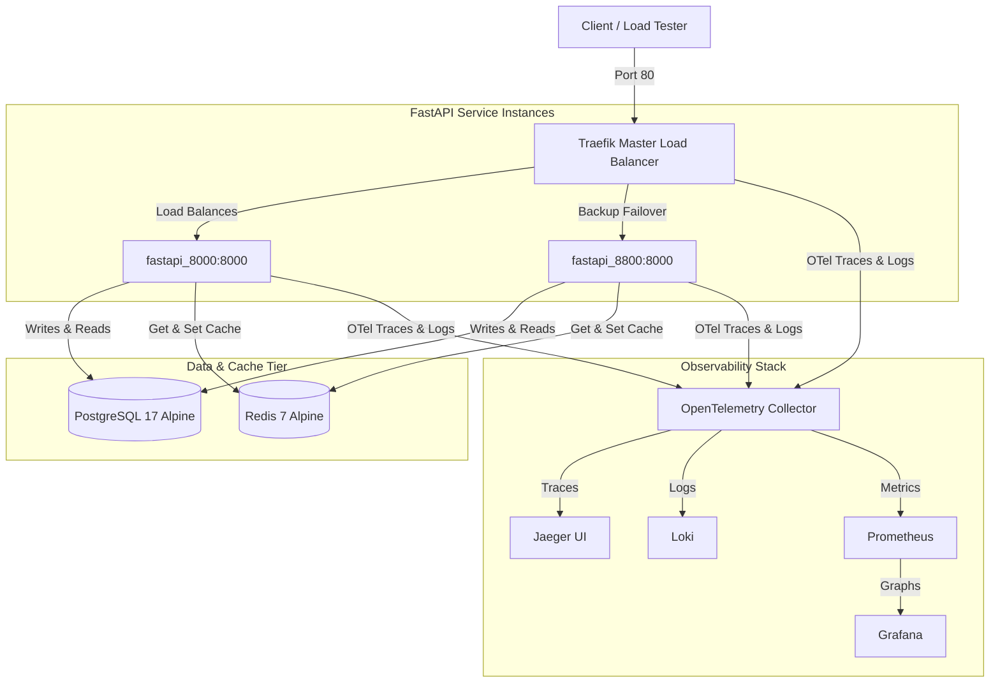

# Load-Balanced FastAPI System Design & Resilience Demo

This project is a high-availability, resilient system design testbed demonstrating modern microservice patterns, including load balancing, databases, distributed caching, observability, and code-level circuit breakers.

---

## 1. System Architecture Overview



---

## 2. Component Enhancements

### A. PostgreSQL 17 Alpine Migration
- **Container**: `postgres:17-alpine` added inside the static IP bridge network at `172.28.0.40`.
- **Driver**: Migrated from SQLite to `psycopg2-binary` with resilient startup retry logic and a `ThreadedConnectionPool` configured to support concurrent, thread-safe FastAPI endpoints.
- **Instrumentor**: Integrated `Psycopg2Instrumentor` to automatically export SQL query traces to Jaeger.

### B. Redis 7 Alpine Caching
- **Container**: `redis:7-alpine` added at `172.28.0.41` to support ultra-fast caching.
- **Driver**: Integrated `redis-py` with auto-ping verification on startup.
- **Instrumentor**: Integrated `RedisInstrumentor` to automatically export cache get/set traces to Jaeger.

### C. Standard Library Code-Level Circuit Breaker Middleware
Instead of relying on Traefik to globally block the site, we transitioned to the industry-standard `circuitbreaker` Python library integrated as a high-performance **ASGI Middleware** inside [main.py](file:///home/ahmad/Desktop/test/system_design/app/main.py) (while preserving the custom resilience telemetry engine in [circuit_breaker.py](file:///home/ahmad/Desktop/test/system_design/app/circuit_breaker.py) for architectural reference):
1. **Global ASGI Middleware**: Intercepts requests destined for resilient endpoints and executes them within the circuit breaker context.
2. **Context-Manager Strategy**: Uses the standard `with cb:` context manager pattern. Because Starlette's `call_next` returns a coroutine object rather than executing it synchronously, awaiting inside the `with` block ensures async exceptions are caught perfectly.
3. **Manual Short-Circuiting**: Solves Starlette/FastAPI's routing exception-swallowing behavior by combining the context manager with a fast-fail `cb.opened` check to immediately return graceful local and Redis fallbacks.
4. **Dynamic Load-Balanced Half-Open Recovery**: Automatically recovery-probes downstream services when in `HALF_OPEN` state, closing the circuit back to `CLOSED` upon success.

### D. Data Tier Protection (PostgreSQL & Redis Circuit Breakers)
To prevent cascading system failures, we added two independent dedicated circuit breakers:
1. **`PostgresBreaker`**: Protects the PostgreSQL database. If database writes or queries fail 3 consecutive times, it trips to `OPEN`, immediately fast-failing subsequent calls to `/db-demo` and returning a graceful local simulated fallback to spare the database while it recovers.
2. **`RedisBreaker`**: Protects the Redis caching tier. If Redis connections fail 3 consecutive times, it trips to `OPEN`, immediately bypassing the cache to perform local calculations directly without slamming the down Redis server with expensive connection attempts and timeouts.

---

## 3. Implementation Details

### Multi-Circuit Breaker Setup
All three circuit breakers are declared and imported from the PyPI `circuitbreaker` package:
```python
# [main.py]
cb = CircuitBreaker(name="FlakyServiceBreaker", failure_threshold=3, recovery_timeout=10.0)
db_breaker = CircuitBreaker(name="PostgresBreaker", failure_threshold=3, recovery_timeout=10.0)
redis_breaker = CircuitBreaker(name="RedisBreaker", failure_threshold=3, recovery_timeout=10.0)
```

### Demonstration Endpoints
The following endpoints showcase system designs and resilience in [main.py](file:///home/ahmad/Desktop/test/system_design/app/main.py):

| Endpoint | Method | Purpose |
|---|---|---|
| `/db-demo` | `GET` | PostgreSQL demo endpoint wrapped inside `PostgresBreaker`. Fast-fails when open. |
| `/cache-demo` | `GET` | Redis cache demo endpoint wrapped inside `RedisBreaker`. Bypasses cache when open. |
| `/flaky-service` | `GET` | Simulates an unreliable external service (70% fail rate). |
| `/circuit-breaker-demo` | `GET` | Invokes `/flaky-service` wrapped in our standard library `CircuitBreaker` middleware. |
| `/circuit-breaker-status` | `GET` | Exposes the real-time internal state of all three circuit breakers. |

---

## 4. Test Results

### A. PostgreSQL Integration Test (`/db-demo`)
The database persists request metadata cleanly, and connections are maintained across instances.
```bash
$ curl http://localhost/db-demo
{"message":"Successfully recorded request in PostgreSQL!","total_requests_recorded":1,"instance_port":"8000"}

$ curl http://localhost/db-demo
{"message":"Successfully recorded request in PostgreSQL!","total_requests_recorded":2,"instance_port":"8000"}
```

### B. Redis Cache Performance Test (`/cache-demo`)
Dramatic speedup is demonstrated between cache miss and cache hit:
```bash
# 1. First Call: Cache MISS (1 second simulated calculation delay)
$ curl -w "\nTime: %{time_total}s\n" http://localhost/cache-demo
{"source":"simulated_expensive_computation","key":"demo_key","value":"computed_at_1779102609.7518115_on_port_8000","instance_port":"8000"}
Time: 1.007s

# 2. Second Call: Cache HIT (Immediate response from Redis)
$ curl -w "\nTime: %{time_total}s\n" http://localhost/cache-demo
{"source":"cache","key":"demo_key","value":"computed_at_1779102609.7518115_on_port_8000","instance_port":"8000"}
Time: 0.003s
```

### C. Circuit Breaker State Transition Test
By forcing consecutive failures with `?fail=true`, we can watch the breaker work:

#### State: CLOSED
- Call 1: Fails (`failure_count: 1`)
- Call 2: Fails (`failure_count: 2`)
- Call 3: Fails (`failure_count: 3` -> Trips to `OPEN`)

#### State: OPEN (Fast-Fail and Return Fallback)
Once `OPEN`, calling the service immediately invokes the short-circuit fallback without executing any HTTP request:
```bash
$ curl http://localhost/circuit-breaker-demo
{
  "status": "circuit_breaker_open_fallback",
  "circuit_breaker_state": "OPEN",
  "message": "Circuit Breaker 'FlakyServiceBreaker' is OPEN. Fast-failing.",
  "fallback_data": "FALLBACK_VALUE_LOCAL (Service Unhealthy)"
}
```

#### State: HALF-OPEN (Testing recovery)
After the 10-second `recovery_timeout` has elapsed, the next incoming request attempts to hit the downstream service again. In our logs, we see:
1. State changes: `OPEN -> HALF-OPEN`
2. Tries to call `/flaky-service?fail=true`
3. Downstream call fails -> State changes: `HALF-OPEN -> OPEN`
4. Circuit Breaker remains in `OPEN` state, continuing to protect the system.

---

## 5. How to Test

### Running Load Tests (Locust)
To spin up a headless load test simulation for 1 minute:
```bash
$ ./.venv/bin/locust --headless -u 10 -r 2 --run-time 1m --host http://localhost
```
Or open the Locust web control dashboard:
```bash
$ ./.venv/bin/locust
```

### Benchmarking (wrk)
To perform high-concurrency stress testing against the distributed trace endpoints (pointing to Traefik's virtual IP `172.28.0.100` or local ingress):
```bash
$ wrk -t20 -c1000 -d30s http://172.28.0.100/trace-demo
```

---

## 6. Standalone System Design Algorithms (For Learning)

To explore core resilience and traffic-shaping algorithms in pure, standalone Python (completely decoupled from the main FastAPI server), navigate to the `algorithms/` folder:

| File | Pattern | Core Mechanism | How to Run |
|---|---|---|---|
| [circuit_breaker.py](file:///home/ahmad/Desktop/test/system_design/algorithms/circuit_breaker.py) | **Circuit Breaker** | Fully custom State Machine (`CLOSED` -> `OPEN` -> `HALF-OPEN`) simulating external service degradation and recovery. | `python3 algorithms/circuit_breaker.py` |
| [token_bucket.py](file:///home/ahmad/Desktop/test/system_design/algorithms/token_bucket.py) | **Token Bucket Rate Limiter** | Efficient **lazy-refill strategy** allowing bursty traffic up to bucket capacity while capping average request throughput. | `python3 algorithms/token_bucket.py` |
| [leaky_bucket.py](file:///home/ahmad/Desktop/test/system_design/algorithms/leaky_bucket.py) | **Leaky Bucket Rate Limiter** | Efficient **lazy-leak strategy** smoothing out sudden bursts completely, outputting steady uniform flow. | `python3 algorithms/leaky_bucket.py` |

---

> [!NOTE]
> All traces are automatically populated with OpenTelemetry `trace_id` and `span_id` contexts, allowing developers to view the full cascading call graph in **Jaeger** (`http://localhost:16686`) and trace structured logs in **Loki / Grafana** (`http://localhost:3000`).