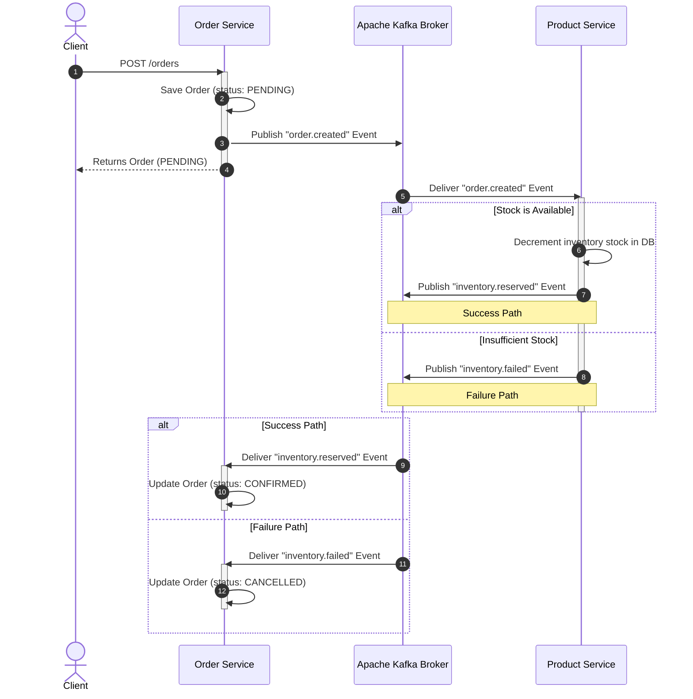

# 🏗️ Event-Driven DDD Microservices Platform with E2E Resilience & Observability

A production-grade, highly available, resilient, and observable E-Commerce platform built using Python **FastAPI**, **Domain-Driven Design (DDD)**, and **Apache Kafka (KRaft mode)**. The system is designed with a decentralized choreographed Saga pattern and robust traffic protection layers, including high-availability gateway routing, rate-limiting, dual-scope circuit breakers, API idempotency, and a complete distributed observability stack.

---

## 🗺️ 1. Architecture Overview

```mermaid
graph TD
    Client["Client / Locust Load Tester"] -->|"Port 80 (Virtual IP)"| Keepalived{"Keepalived Master/Backup VRRP"}
    Keepalived -->|"Active Ingress"| Traefik["Traefik Master Load Balancer"]
    Keepalived -.->|"Failover Ingress"| TraefikBackup["Traefik Backup Load Balancer"]

    subgraph API Gateway Routing (Traefik)
        Traefik & TraefikBackup -->|"Rate Limiting & Load Shedding"| Router["Path-Based Prefix Router"]
    end

    subgraph DDD Bounded Contexts (FastAPI)
        Router -->|"/users/*"| UserServ["user-service:8001"]
        Router -->|"/products/*"| ProdServ["product-service:8002"]
        Router -->|"/orders/*"| OrdServ["order-service:8003"]
    end

    subgraph Data & Caching Tier
        UserServ -->|"db_breaker"| UserDB[("user_db: PostgreSQL")]
        ProdServ -->|"db_breaker"| ProdDB[("product_db: PostgreSQL")]
        OrdServ -->|"db_breaker"| OrdDB[("order_db: PostgreSQL")]
        
        UserServ & ProdServ & OrdServ -->|"Idempotency Cache"| Redis[("redis: Redis 7")]
    end

    subgraph Asynchronous Event Broker
        UserServ -.->|"kafka_breaker"| Kafka[("Apache Kafka KRaft Broker")]
        ProdServ -.->|"kafka_breaker"| Kafka
        OrdServ -.->|"kafka_breaker"| Kafka
        
        Kafka -.->|"Event Subscription / Inbox Pattern"| UserServ
        Kafka -.->|"Event Subscription / Inbox Pattern"| ProdServ
        Kafka -.->|"Event Subscription / Inbox Pattern"| OrdServ
    end

    subgraph Distributed Observability Stack
        UserServ & ProdServ & OrdServ & Traefik -->|OTel Traces & Metrics| OTel["OTel Collector:4317"]
        OTel -->|Traces| JG["Jaeger UI:16686"]
        OTel -->|Metrics| PR["Prometheus:9090"]
        OTel -->|Logs| LK["Loki:3100"]
        PR -->|Dashboards| GF["Grafana:3000"]
        PR -->|Alerts| AM["Alertmanager:9093"]
    end
```

---

## 🛡️ 2. Resilience, Protection & Reliability Features

The system implements multi-layered protection to guarantee extreme reliability, operational stability, and self-healing behavior under stress or service degradation:

### A. Ingress Gateway Protection (Traefik)
- **High Availability**: Programmed with active-passive **Keepalived VRRP** clustering (Virtual IP `172.20.0.100`), ensuring instantaneous, zero-downtime failover between `traefik-master` and `traefik-backup`.
- **Rate-Limiting**: Limits average traffic to 30 requests/sec with a burst tolerance of 50 requests. Sudden volume spikes are throttled instantly, returning a `429 Too Many Requests` response to safeguard downstream services.
- **Load-Shedding**: Capped at 50 concurrent in-flight requests. Excess traffic is shed gracefully, preventing resource exhaustion.

### B. Dual-Scope & Database Circuit Breakers
Implemented via a custom async-native `AsyncCircuitBreaker` wrapper (`shared/common/resilience.py`) for complete operational safety:
1. **`db_breaker` (Internal Persistence Protection)**: Applied to every database interaction. If a PostgreSQL instance encounters three consecutive failures (socket timeout, database offline, lock contention), the circuit trips to `OPEN`. Downstream transactions immediately fast-fail with a custom `503 Service Unavailable`, preventing connection-pool deadlock.
2. **`kafka_breaker` (Broker Connectivity Protection)**: Protects event publishing. Prevents background threads from blocking if the Kafka broker experiences transient disconnects or partition rebalances.
3. **Resilient HTTP Client**: Built-in HTTP client wrapper (`shared/common/http_client.py`) automatically wraps external REST calls in a dedicated circuit breaker with exponential backoff retries.
4. **Self-Healing Recovery State Machine**: When the circuit trips, the breaker enters `OPEN` state. After a 15-second cooling period, the next transaction probe transitions the state to `HALF-OPEN`. A successful interaction fully closes the circuit back to `CLOSED`; any failure trips it back to `OPEN`.

### C. End-to-End REST API Idempotency (Redis-Backed)
- Implemented via a high-performance `@idempotent_api` decorator (`shared/common/idempotency.py`).
- Requires mutating requests (`POST`) to contain a unique `X-Idempotency-Key` header.
- Upon receiving a request, the service checks Redis. If the key exists, it returns the cached response instantly, skipping database persistence and business execution. If not, it executes the operation, caches the result in Redis with a TTL, and returns.

### D. Asynchronous Event Consumer Idempotency (Inbox Pattern)
- Event-driven platforms are susceptible to duplicate events due to broker partition rebalancing or network retries.
- We enforce the **Inbox Pattern** at the database layer. A persistent SQL table `idempotent_consumers` tracks every processed event ID.
- Consumers verify and record event IDs in a single atomic transaction. Duplicate events are silently discarded, guaranteeing that stock levels and order statuses are updated exactly once.

---

## 🏢 3. DDD Bounded Contexts & Clean Architecture

Each microservice is a self-contained bounded context strictly isolating its domain, Ubiquitous Language, and database schema, conforming to clean architecture standards:

```
[Presentation Layer]  <-- API routers, Request/Response schemas
       │
       ▼
[Application Layer]   <-- Use Cases, Commands, Handlers, Application Services
       │
       ▼
  [Domain Layer]      <-- Aggregate Roots, Entities, Value Objects, Domain Events
       ▲
       │
[Infrastructure Layer]<-- ORM Models, DB migrations, Settings & Config
       ▲
       │
 [Adapter Layer]      <-- Repositories (SQLAlchemy), Event Pub/Sub adapters
```

### The 5 Layers in Detail

| Layer | Responsibility | Key Component Examples |
| :--- | :--- | :--- |
| **Domain** | Contains the enterprise business logic, entities, aggregates, validation rules, and domain events. Zero external dependencies. | `User` Entity, `Product` Aggregate, `Order` Aggregate, `DomainException` |
| **Application** | Orchestrates the domain objects to execute specific use cases. Translates external inputs into commands. | `OrderApplicationService`, `ConfirmOrderCommand` |
| **Infrastructure** | Integrates databases, framework components (FastAPI setup), configuration settings, and OpenTelemetry. | `db_setup.py`, `config.py`, SQLAlchemy tables |
| **Presentation** | Exposes HTTP routes, handles JSON serialization/deserialization, and maps HTTP requests to Pydantic schemas. | `api.py` (FastAPI Routers), `RegisterUserRequest` Schema |
| **Adapter** | Implements domain repository interfaces (SQLAlchemy persistence) and maps message broker events (Kafka). | `SQLAlchemyOrderRepository`, `OrderMessagingPublisher` |

### Bounded Context Directory Layout
```
system_design/
├── docker-compose.yml                  # Core cluster (databases, Kafka KRaft, microservices)
├── docker-compose.observability.yml    # Telemetry cluster (Prometheus, Grafana, Jaeger, Loki, OTel)
├── shared/                             # Common code packages shared between services
│   ├── contracts/
│   │   └── events.py                   # Pydantic models for shared integration events
│   └── common/
│       ├── database.py                 # Async SQLAlchemy DB connection helper
│       ├── messaging.py                # Resilient async aiokafka Kafka manager wrapper
│       ├── resilience.py               # Central AsyncCircuitBreaker definition
│       ├── idempotency.py              # Redis API idempotency & SQL inbox deduplication
│       └── http_client.py              # Resilient service-to-service HTTP client
├── services/                           # Microservice Bounded Contexts
│   ├── user-service/
│   │   ├── Dockerfile                  # Multi-stage container build
│   │   ├── requirements.txt            # Python dependencies (includes email-validator & aiokafka)
│   │   └── src/                        # DDD 5-layer codebase
│   ├── product-service/
│   │   ├── Dockerfile
│   │   ├── requirements.txt
│   │   └── src/
│   └── order-service/
│       ├── Dockerfile
│       ├── requirements.txt
│       └── src/
└── otel-collector-config.yaml          # OpenTelemetry central metrics/trace pipeline router
```

---

## 🔄 4. Asynchronous Event-Driven Saga Pattern

To maintain transactional consistency across our isolated databases without resorting to slow distributed locks or blocking two-phase commits (2PC), we implement an **asynchronous choreographed Saga pattern**:



---

## ⚡ 5. Getting Started & Running the Platform

### A. Environment Configuration
Create your local environment file from the template:
```bash
cp .env.example .env
```
Fill in the custom database credentials, port configurations, and Redis credentials. The system automatically reads and applies these variables during startup.

### B. Start the Platform
1. **Launch the core system**:
   ```bash
   docker compose up --build -d
   ```
   This spins up the three microservices, their autonomous databases, Traefik, Keepalived high-availability instances, Redis cache, and the Kafka broker in KRaft mode.

2. **Launch the telemetry stack**:
   ```bash
   docker compose -f docker-compose.observability.yml up -d
   ```
   This starts the OpenTelemetry Collector, Prometheus, Grafana, Jaeger, Loki, and Alertmanager.

---

## 📊 6. Interactive Documentation & Dashboards

| Service / Interface | Host Port | Ingress Gateway Route / Address |
| :--- | :--- | :--- |
| **Traefik Ingress Gateway** | `80` | `http://localhost/` (or Virtual IP `172.20.0.100`) |
| **User Service OpenAPI Docs** | `8001` | `http://localhost/users/docs` or `http://localhost:8001/docs` |
| **Product Service OpenAPI Docs**| `8002` | `http://localhost/products/docs` or `http://localhost:8002/docs` |
| **Order Service OpenAPI Docs** | `8003` | `http://localhost/orders/docs` or `http://localhost:8003/docs` |
| **Jaeger Distributed Tracing** | `16686` | `http://localhost:16686/` |
| **Grafana Telemetry Dashboard**| `3000` | `http://localhost:3000/` |
| **Prometheus Metrics Engine** | `9090` | `http://localhost:9090/` |
| **Alertmanager Controller** | `9093` | `http://localhost:9093/` |

---

## 🧪 7. End-to-End Integration Verification

You can easily verify the choreographed Saga and E2E resilience mechanisms directly through the Traefik Gateway (Port `80`).

### 1. User Registration (REST API Idempotency)
Register a new user context. Make sure to specify the `X-Idempotency-Key` header:
```bash
curl -i -X POST http://localhost/users \
  -H "Content-Type: application/json" \
  -H "X-Idempotency-Key: register-user-101" \
  -d '{"username": "johndoe", "email": "john@example.com", "password": "securepassword123"}'
```
**Verification**: Send the exact same request again. You will receive an instantaneous `201 Created` response. Check the `user-service` container logs:
```log
user-service  | INFO: Idempotency hit! Returning cached response for key: idem:user-service:register-user-101
```
This confirms that Redis-backed API idempotency was hit and bypassed the database.

### 2. Product Catalog Creation
Create a product for ordering:
```bash
curl -i -X POST http://localhost/products \
  -H "Content-Type: application/json" \
  -H "X-Idempotency-Key: create-product-201" \
  -d '{"name": "Mechanical Keyboard", "price": 99.99, "stock": 15}'
```

### 3. Saga Transaction — Success Path (Stock Available)
Place an order for 2 keyboards (Catalog has 15 in stock):
```bash
curl -i -X POST http://localhost/orders \
  -H "Content-Type: application/json" \
  -H "X-Idempotency-Key: submit-order-301" \
  -d '{"user_id": 1, "product_id": 1, "quantity": 2, "total_price": 199.98}'
```
**Verification Logs**:
- `order-service` writes a `PENDING` order, publishes `order.created` to Kafka, and returns `201 Created`.
- `product-service` consumes `order.created`, decrements database stock from `15` to `13`, and publishes `inventory.reserved` to Kafka.
- `order-service` consumes `inventory.reserved` and transitions the order status to `CONFIRMED`.

Verify the final order status and remaining catalog stock:
```bash
# Get Order #1 Details (Should reflect status: CONFIRMED)
curl http://localhost/orders/1

# Get Product #1 Details (Should reflect stock: 13)
curl http://localhost/products/1
```

### 4. Saga Transaction — Failure Path (Insufficient Stock)
Attempt to place an order for 20 keyboards (Catalog has only 13 in stock):
```bash
curl -i -X POST http://localhost/orders \
  -H "Content-Type: application/json" \
  -H "X-Idempotency-Key: submit-order-302" \
  -d '{"user_id": 1, "product_id": 1, "quantity": 20, "total_price": 1999.80}'
```
**Verification Logs**:
- `order-service` writes a `PENDING` order, publishes `order.created` to Kafka, and returns `201 Created`.
- `product-service` consumes `order.created`, detects insufficient stock, and publishes `inventory.failed` to Kafka.
- `order-service` consumes `inventory.failed` and transitions the order status to `CANCELLED`.

Verify the final order status and catalog stock (retains original stock level):
```bash
# Get Order #2 Details (Should reflect status: CANCELLED)
curl http://localhost/orders/2

# Get Product #1 Details (Should reflect stock: 13)
curl http://localhost/products/1
```

### 5. Programmatic Circuit Breaker & Self-Healing Demo
Simulate a database server outage by stopping the User Postgres container:
```bash
docker compose stop user-db
```
Send GET requests to fetch User #1 through the Gateway:
```bash
curl -i http://localhost/users/1
```
**Verification**:
- The first 3 requests return `500 Internal Server Error` due to socket timeouts as the connection fails.
- The 4th request instantly triggers a `503 Service Unavailable` response from our `db_breaker`:
  ```json
  {"detail": "Database circuit breaker active: Circuit PostgresBreaker is OPEN."}
  ```
  This indicates that the circuit has tripped to `OPEN`, fast-failing downstream calls immediately.
- Restart the container: `docker compose start user-db`
- Wait 15 seconds (cooldown period), then query the endpoint again. The circuit probe transitions to `HALF-OPEN`, successfully queries User #1, closes the breaker, and returns `200 OK`.

### 6. Load & Performance Testing (Locust)
A robust `locustfile.py` load tester is included. To trigger headless performance testing:
```bash
locust --headless -u 10 -r 2 --run-time 1m --host http://localhost
```
Or open the Locust dashboard using:
```bash
locust
```
And navigate to `http://localhost:8089` to specify target users, ramp-up rates, and view live response-time and error graphs.

---

## 📝 8. Stand-Alone System Design Algorithms (For Learning)

To explore core traffic shaping and resilience algorithms in pure, stand-alone Python (completely decoupled from the running microservices), navigate to the `algorithms/` folder:

| File | Pattern | Core Mechanism | How to Run |
|---|---|---|---|
| [circuit_breaker.py](file:///home/ahmad/Desktop/test/system_design/algorithms/circuit_breaker.py) | **Circuit Breaker** | A state machine simulating failures, transition phases (`CLOSED`, `OPEN`, `HALF-OPEN`), and auto-recovery. | `python3 algorithms/circuit_breaker.py` |
| [token_bucket.py](file:///home/ahmad/Desktop/test/system_design/algorithms/token_bucket.py) | **Token Bucket** | Efficient **lazy-refill strategy** allowing bursty traffic up to bucket capacity while capping average request throughput. | `python3 algorithms/token_bucket.py` |
| [leaky_bucket.py](file:///home/ahmad/Desktop/test/system_design/algorithms/leaky_bucket.py) | **Leaky Bucket** | Efficient **lazy-leak strategy** smoothing out sudden bursts completely, outputting steady uniform flow. | `python3 algorithms/leaky_bucket.py` |

---

> [!NOTE]
> All traces are automatically populated with OpenTelemetry `trace_id` and `span_id` contexts, allowing developers to view the full cascading call graph in **Jaeger** (`http://localhost:16686`) and trace structured logs in **Loki / Grafana** (`http://localhost:3000`).