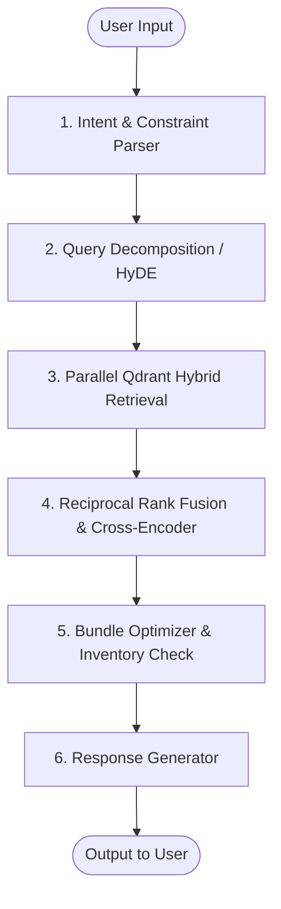
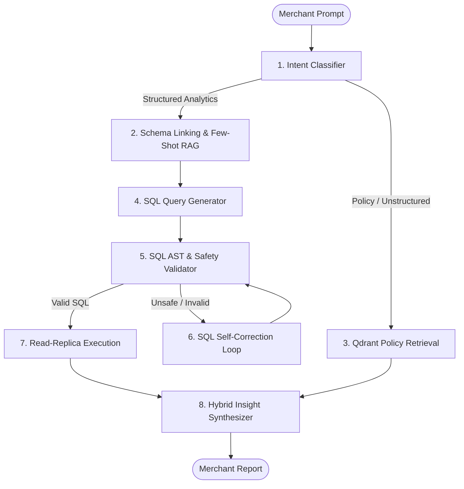
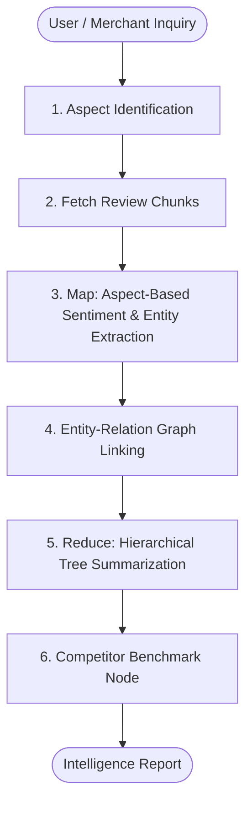
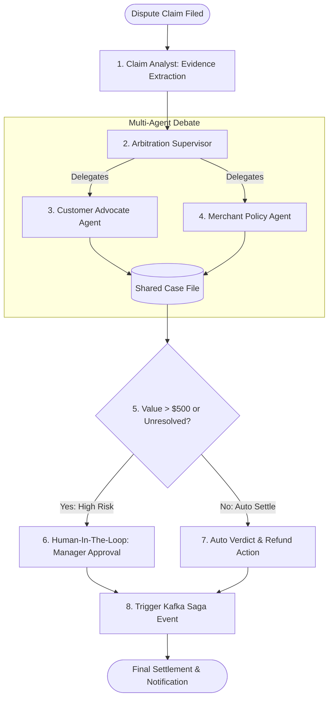
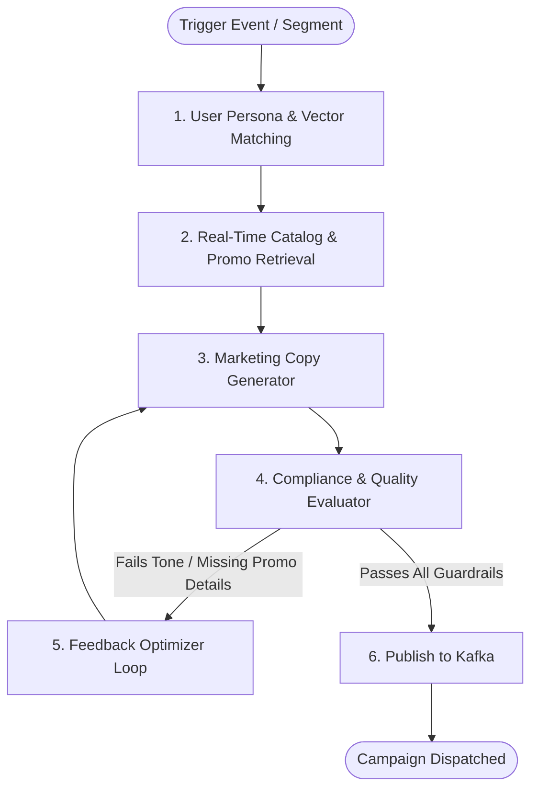

# Advanced RAG & LangGraph Implementation Roadmap

This document outlines **5 production-grade AI microservice architectures** designed to extend this e-commerce platform and master **Advanced Retrieval-Augmented Generation (RAG)** and **LangGraph Multi-Agent Orchestration**.

---

## 🗺️ Architectural Comparison Matrix

| # | Service Name | Core RAG Patterns | Key LangGraph Patterns | Complexity |
| :-: | :--- | :--- | :--- | :-: |
| **1** | **`discovery-service`**<br>*(Semantic Product Finder & Bundler)* | HyDE, Multi-Query Decomposition, Qdrant Payload Filtering, Reciprocal Rank Fusion (RRF) | Multi-Turn Conversational State Machine, Budget/Constraint Optimization Node | 🟡 Medium |
| **2** | **`merchant-copilot-service`**<br>*(Text-to-SQL + Unstructured Policy RAG)* | Hybrid Structured (SQL) + Unstructured (Vector) RAG, Schema Linking, Dynamic Few-Shot Examples | Self-Correction Error Loops, Parallel Branch Execution, AST SQL Validation | 🔴 Advanced |
| **3** | **`review-intelligence-service`**<br>*(Aspect-Based Sentiment & GraphRAG)* | GraphRAG (Entity-Relation Extraction), Hierarchical Clustering (RAPTOR), Dense + BM25 | Map-Reduce Aggregation Subgraphs, Aspect-Based Sentiment Extraction | 🔴 Advanced |
| **4** | **`dispute-resolution-service`**<br>*(Multi-Agent Negotiation & Claims)* | Corrective RAG (CRAG), Evidence Retrieval, Multi-Document Verification | Multi-Agent Supervisor / Debate Pattern, Human-in-the-Loop (`interrupt()`) | 🟣 Expert |
| **5** | **`marketing-service`**<br>*(Personalized Campaign & Copy Generator)* | Persona Vector Embeddings, Contextual Brand Voice RAG, Rule Checking | Evaluator-Optimizer Feedback Loops, Quality & Compliance Guardrail Grading | 🟡 Medium |

---

## 1. 🔍 Semantic Product Discovery & Bundle Builder (`discovery-service`)

### Overview
Replaces rigid keyword searching with natural-language, multi-constraint product discovery and bundle creation (e.g., *"Find me a full gaming setup under \$1,500 with a mechanical keyboard, 144Hz monitor, and high-performance laptop"*).

### 📐 LangGraph Workflow Diagram


### 🧠 Key Technical Concepts
1. **HyDE (Hypothetical Document Embeddings)**:
   - The LLM generates a hypothetical product spec sheet before vector search to bridge the semantic gap between vague user queries and dense technical catalog descriptions.
2. **Query Decomposition**:
   - Deconstructs complex requests into discrete search intents (`[Query A: "144Hz monitor", Query B: "mechanical keyboard", Query C: "gaming laptop"]`).
3. **Qdrant Payload Filtering**:
   - Executes dense semantic matching strictly within pre-filtered metadata subsets (`price <= budget`, `is_in_stock == True`, `tenant_id == store_tech`).
4. **LangGraph State Management**:
   ```python
   class DiscoveryState(TypedDict):
       messages: list[BaseMessage]
       extracted_constraints: dict[str, Any]  # budget, category, specs
       sub_queries: list[str]
       candidate_products: list[ProductDTO]
       selected_bundle: list[ProductDTO]
       total_price: float
       is_satisfied: bool
   ```

---

## 2. 📊 Merchant Analytics & Text-to-SQL Copilot (`merchant-copilot-service`)

### Overview
Enables store owners and managers to query structured sales databases and unstructured merchant policy guidelines simultaneously through natural language.

### 📐 LangGraph Workflow Diagram


### 🧠 Key Technical Concepts
1. **Hybrid Structured + Unstructured RAG**:
   - Executes dynamic SQL against PostgreSQL (`orders`, `order_items`, `payments`) while simultaneously retrieving unstructured supplier SLA and return policy documentation from Qdrant.
2. **Schema Linking & Dynamic Few-Shot RAG**:
   - Embeds database DDL schemas and successful past query examples in a vector index, retrieving only the relevant table schemas into the LLM context.
3. **Self-Correcting Execution Loop**:
   - If PostgreSQL returns a syntax error, type mismatch, or empty result, the error traceback is routed to a `sql_fixer` node to regenerate the query without breaking the session.

---

## 3. ⭐️ Customer Review & Sentiment Intelligence Engine (`review-intelligence-service`)

### Overview
Extracts granular product intelligence from thousands of customer reviews using knowledge graphs and recursive hierarchical summarization.

### 📐 LangGraph Workflow Diagram


### 🧠 Key Technical Concepts
1. **GraphRAG (Knowledge Graph Linking)**:
   - Extracts `(Entity -> Relation -> Entity)` triples from review text:
     - `("Gaming Laptop Pro" -> HAS_FEATURE -> "OLED Display")`
     - `("Battery Life" -> HAS_SENTIMENT -> "Negative under heavy load")`
2. **RAPTOR (Recursive Abstractive Processing for Tree-Organized Retrieval)**:
   - Recursively clusters review embeddings and builds multi-tier summary trees, allowing the model to answer high-level questions (*"What is the overall sentiment?"*) and low-level questions (*"Did anyone complain about HDMI port wobble?"*).
3. **LangGraph Map-Reduce Pattern**:
   - Uses `Send()` to fan out multiple review batches in parallel and reduces the extractions into a single structured sentiment summary.

---

## 4. 🤝 Multi-Agent Dispute & Return Negotiation (`dispute-resolution-service`)

### Overview
A multi-agent arbitration system where independent AI agents represent the customer's interests, the merchant's financial policies, and an impartial supervisor to settle complex returns.

### 📐 LangGraph Workflow Diagram


### 🧠 Key Technical Concepts
1. **Multi-Agent Supervisor Pattern**:
   - Separate agents with opposing goals (Customer Advocate maximizes satisfaction; Merchant Agent enforces margin and fraud limits) present arguments based on evidence.
2. **Corrective RAG (CRAG)**:
   - Verifies customer claims against tracking logs, product warranty databases, and statutory consumer rights.
3. **Human-in-the-Loop (HITL)**:
   - Uses LangGraph's `interrupt()` primitive to freeze state in PostgreSQL when claim values exceed \$500, waiting for a human manager's resume token.

---

## 5. 📢 Personalized Marketing Campaign Generator (`marketing-service`)

### Overview
Generates tailored promotional campaigns, emails, and notifications based on customer purchase history, real-time inventory, and brand voice guidelines.

### 📐 LangGraph Workflow Diagram


### 🧠 Key Technical Concepts
1. **User Persona Embeddings**:
   - Converts user purchase frequency, preferred categories, and price sensitivity into vector embeddings to find matching promotional bundles.
2. **Contextual Brand Voice RAG**:
   - Retrieves active campaign markdown guides, discount codes, and regulatory disclaimers.
3. **Evaluator-Optimizer Loop**:
   - An adversarial grader tests the generated copy against a rubric (tone of voice, discount accuracy, hallucination check) before approving publication.

---

## 🚀 Suggested Implementation Order

1. **Phase 1**: Implement **`discovery-service`** to learn **HyDE, Multi-Query RAG, and Conversational State**.
2. **Phase 2**: Implement **`merchant-copilot-service`** to master **Text-to-SQL and Self-Correction Loops**.
3. **Phase 3**: Implement **`dispute-resolution-service`** to master **Multi-Agent Collaboration, LangGraph Supervisors, and Human-in-the-Loop workflows**.
